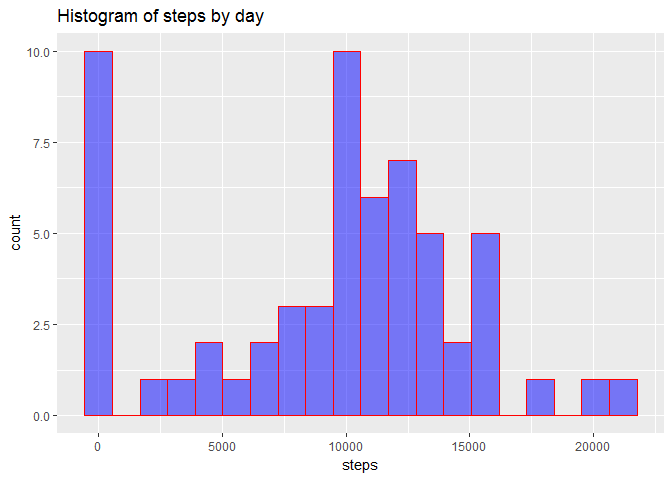
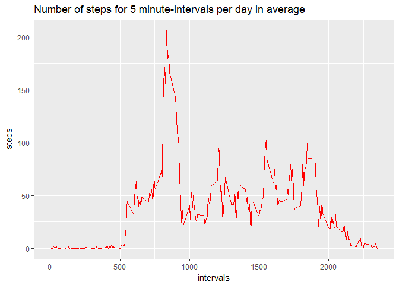
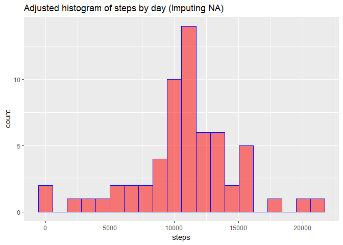
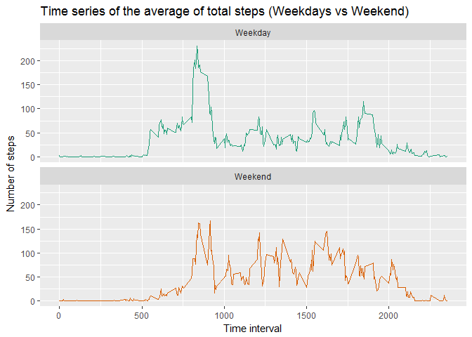

# Reproducible Research: Peer Assessment 1


## Loading and preprocessing the data

Here is the code to check if the data are available and for download it if necessary.  


```r
rm(list = ls())

setwd("C:/Users/QUEGUINER/Desktop/Cours/Autre/Coursera/Reproducible Research/week2/RepData_PeerAssessment1")

if (!dir.exists("data")){
    dir.create("data")
}

if (!file.exists("data/activity.csv")){
    if(!file.exists("activity.zip")){
        download.file("https://d396qusza40orc.cloudfront.net/repdata%2Fdata%2Factivity.zip","activity.zip")
    }
    unzip("activity.zip", exdir = "data")
    file.remove("activity.zip")
}

activity <- read.csv("data/activity.csv")
str(activity)
```

```
## 'data.frame':	17568 obs. of  3 variables:
##  $ steps   : int  NA NA NA NA NA NA NA NA NA NA ...
##  $ date    : Factor w/ 61 levels "2012-10-01","2012-10-02",..: 1 1 1 1 1 1 1 1 1 1 ...
##  $ interval: int  0 5 10 15 20 25 30 35 40 45 ...
```
There are 3 variables in the data:  

* **steps:** *integer* number of steps for a five-minute interval
* **date:** *factor* the 61 dates in format YYYY-MM-DD. That could be useful to convert in a date format.


```r
activity$date <- as.Date(activity$date)
```
* **interval** *integer* the 5 minute intrval of the day from 0 to 2355.  


## What is mean total number of steps taken per day?


```r
library(ggplot2)
```

```
## Warning: package 'ggplot2' was built under R version 3.3.2
```

```r
steps_by_day <- with(activity, tapply(steps, date, sum, na.rm = T))

qplot(steps_by_day, geom = "histogram", bins = 20,
      fill = I("blue"), col = I("red"), alpha = I(0.5),
      main = "Histogram of steps by day", xlab = "steps")
```

<!-- -->

```r
mean1 <- mean(steps_by_day)
median1 <- median(steps_by_day)
```
That histogram shows that the person often makes more than 10 000 steps per day. There are 10 days with no steps, this is quite strange and probably due to missing values.  
The mean total number of steps taken per day is 9354 and the median is 10395.


## What is the average daily activity pattern?


```r
mean_by_interval <- with(activity, tapply(steps, interval, mean, na.rm = T))

qplot(x = as.integer(names(mean_by_interval)), y = mean_by_interval,
      geom = "line", col = I("red"), xlab = "intervals", ylab = "steps",
      main = "Number of steps for 5 minute-intervals per day in average")
```

<!-- -->

```r
interval_max_steps <- max(mean_by_interval)
interval_max <- names(which(mean_by_interval == interval_max_steps))
```

We can notice that the person doesn't walk at all from 11 p.m. to 5 a.m. There is a peak of steps up to 200 steps in a period of 5 minutes in the morning around 8 and 9 a.m. Then, the average of steps during the day from 10 a.m. to 6 p.m s about 50 steps by interval of five minutes. And it begins to decrease at 7 p.m.  
The interval with the most steps in average is the interval 835 that corresponding of the interval from **8.35 to 8.40 a.m.** and the person does **206 steps in average** during these five minutes.


## Imputing missing values


```r
#sapply(activity, function(x) any(is.na(x)))
colSums(is.na(activity))
```

```
##    steps     date interval 
##     2304        0        0
```

```r
# There are missing values only for the variable steps

nb_NA <- sum(is.na(activity))
```

The number of missing values of steps number for this dataset is **2304**. That represents 13% of the rows which is not insignificant.  
Let's remplace these missing values by the mean of steps of the corresponding interval. Then we will create a new data frame **activity2** without missing values.


```r
na_data <- subset(activity, is.na(steps))
index <- rownames(na_data)
na_data$steps <- mean_by_interval[as.character(na_data$interval)]

activity2 <- activity
activity2[index, ] <- na_data

# Check if it works:
colSums(is.na(activity2))
```

```
##    steps     date interval 
##        0        0        0
```

We will produce the same histogram of the first part but with our new dataset.


```r
steps_by_day2 <- with(activity2, tapply(steps, date, sum))

qplot(steps_by_day2, geom = "histogram", bins = 20,
      fill = I("red"), col = I("blue"), alpha = I(0.5),
      main = "Adjusted histogram of steps by day (Imputing NA)", xlab = "steps")
```

<!-- -->

```r
mean2 <- mean(steps_by_day2)
median2 <- median(steps_by_day2)
```

Here it's the histogram of the total number of steps taken each day after missing values are imputed. It seems to be a better histograme since it looks like more a normal distribution than the previous histogram.  
Now, the new mean of steps by day is 10 766 and the median is also 10 766 steps. The fact that these values are equals results of using mean values to impute missing values. And theses values are greater than those without imputing missing values.

## Are there differences in activity patterns between weekdays and weekends?


```r
activity2$day.type <- ifelse(weekdays(activity2$date) %in% c("samedi", "dimanche"), "Weekend", "Weekday")
activity2$day.type <- as.factor(activity2$day.type)

weekdiff <- aggregate(steps ~ interval + day.type, activity2, mean)

g1 <- ggplot(weekdiff, aes(interval, steps)) + 
    geom_line(aes(col = day.type), show.legend = F) + 
    facet_wrap(~ day.type, ncol = 1, strip.position = "top") +
    labs(title = "Time series of the average of total steps (Weekdays vs Weekend)",
         x = "Time interval", y = "Number of steps") +
    scale_color_brewer(palette = "Dark2")

print(g1)
```

<!-- -->

The activity between the weekend and the weekdays is quite different. He does less steps on the morning (around 8 a.m.) during the weekend than during the weekdays. However he walks more regularly during the day (from 10 a.m. to 6 p.m.) during the weekend.


